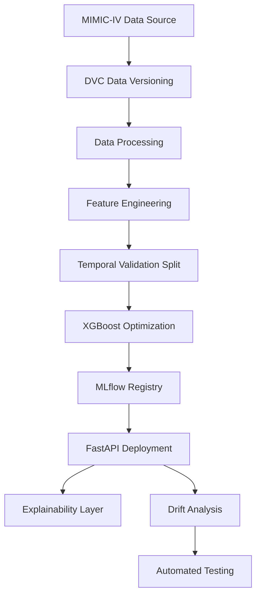

# ICU Precision Monitoring — Industrial MLOps Dashboard

An industry-grade MLOps system for predicting patient deterioration in the Intensive Care Unit, leveraging the MIMIC-IV dataset.

## ⚡ Engineered CI/CD Lifecycle


## System Architecture



## Execution Guide

### 1. Environment Setup
```bash
pip install -r requirements.txt
pip install -r requirements-dev.txt
```

### 2. Pipeline Orchestration
Run individual steps or the full lifecycle:
```bash
# Run full pipeline
python pipeline.py --step all

# Run specific stages
python pipeline.py --step data
python pipeline.py --step train
python pipeline.py --step test
```

### 3. Service Interface (API)
Start the production server:
```bash
uvicorn api.main:app --host 0.0.0.0 --port 8000
```

**Health Check:**
```bash
curl http://localhost:8000/health
```

**Predictive Inference:**
```bash
curl -X POST http://localhost:8000/predict \
     -H "Content-Type: application/json" \
     -d '{
       "subject_id": "P-123",
       "stay_id": "S-456",
       "gender": 1,
       "anchor_age": 65,
       "vitals": {
         "heart_rate": [80, 85, 90],
         "spo2": [98, 97, 96]
       }
     }'
```


## Quality Assurance
Execute the complete test suite:
```bash
pytest tests/ -v
```

---
Built with Python 3.11, XGBoost, MLflow, FastAPI, DVC, and Docker.
